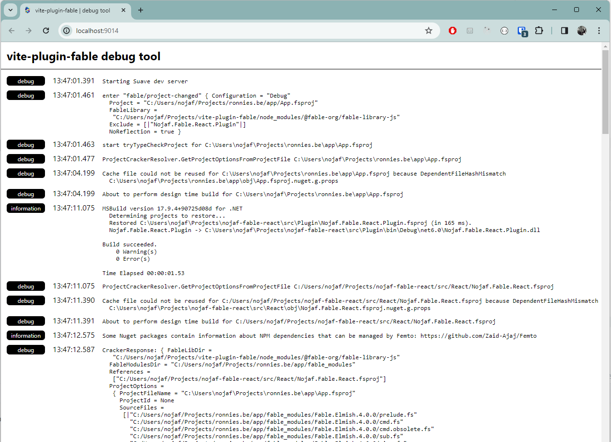

# Debugging

This plugin is a wonderful piece until it no longer works. Then it just sucks, and who knows where in the rabbit hole the problem lies.  
The biggest fear this plugin can face is when the dotnet process no longer responds.
Even if it is not able to process the incoming request, it should always be able to produce a response.

## What the plugin prints

By default the plugin is quiet: one line per compile, plus diagnostics and errors.

```text
  3:42:12 PM [vite] [fable] compiled App.fsproj in 1.53s
  3:42:29 PM [vite] [fable] compiled Greeting.fs in 0.05s
```

When that is not enough, turn on the `debug` option:

```js
export default defineConfig({
  plugins: [fable({ debug: true })],
});
```

That adds every hook the plugin runs, every file it transforms, where it resolved `fable-library`,
the cracking and type-checking timings, and whatever the daemon writes to stderr. Paths are printed
relative to the Vite root.

## Debug viewer

Turning on `debug` also starts a small server inside the dotnet process, on port 9014. Either
switch does it, the option or the environment variable:

```js
export default defineConfig({
  plugins: [fable({ debug: true })],
});
```

```bash
# bash
export VITE_PLUGIN_FABLE_DEBUG=1
```

```pwsh
# PowerShell
$env:VITE_PLUGIN_FABLE_DEBUG=1
```

When running Vite, you should see this among the debug output:

```text
  3:43:20 PM [vite] [fable] daemon: log viewer at http://127.0.0.1:9014, JSON endpoints at http://127.0.0.1:9014/api
```

Opening [http://localhost:9014](http://localhost:9014) will display a list of log messages that happened inside the dotnet process:



It should receive new log messages via web sockets after the initial page load.

Two dev servers would fight over the port, so give the second one its own with
`VITE_PLUGIN_FABLE_DEBUG_PORT`. A running daemon also writes
`$TMPDIR/vite-plugin-fable/daemon-<pid>.json` with the port it settled on, which is how a tool that
did not start it can find it.

## Asking the daemon what it is doing

The page above is for reading. The same server answers JSON under `/api`, which is for anything
that is not a pair of eyes: a script, a terminal, an editor, an AI agent. `curl` the index to see
what there is:

```bash
curl http://127.0.0.1:9014/api
```

| Endpoint           | What it answers                                                                                                                                                                            |
| ------------------ | ------------------------------------------------------------------------------------------------------------------------------------------------------------------------------------------ |
| `/api/status`      | Whether the daemon is alive, what it is serving, and how much of it compiled.                                                                                                              |
| `/api/project`     | The crack result: source files in compile order, watched MSBuild inputs, target framework. `?include=args,references` adds the compiler arguments and assembly references.                 |
| `/api/files`       | Every source file with its compile-order index and emitted size. `?path=<file>` returns one file including the JavaScript Fable emitted for it; `?source=false` leaves the JavaScript out. |
| `/api/diagnostics` | Current diagnostics, unfiltered. `?severity=error` and `?file=<file>` narrow it.                                                                                                           |
| `/api/cache`       | Whether the design time build cache answered the last crack, and which input invalidated it.                                                                                               |
| `/api/requests`    | The last 100 JSON-RPC requests with their durations and outcomes.                                                                                                                          |
| `/api/logs`        | The log as JSON. `?since=<index>` resumes from the `nextSince` of a previous response.                                                                                                     |

So the compiled output of a single file, without running a build:

```bash
curl "http://127.0.0.1:9014/api/files?path=Greeting.fs"
```

Two things worth knowing. Everything here is read-only: no endpoint compiles, cracks or
invalidates anything, because the daemon only knows which files changed because the plugin tells
it, and a second writer would break that. And every response carries a `revision` that goes up by
one for each request the daemon serves, so you can tell whether what you are reading already
includes the edit you just made.

[Next]({{fsdocs-next-page-link}})
